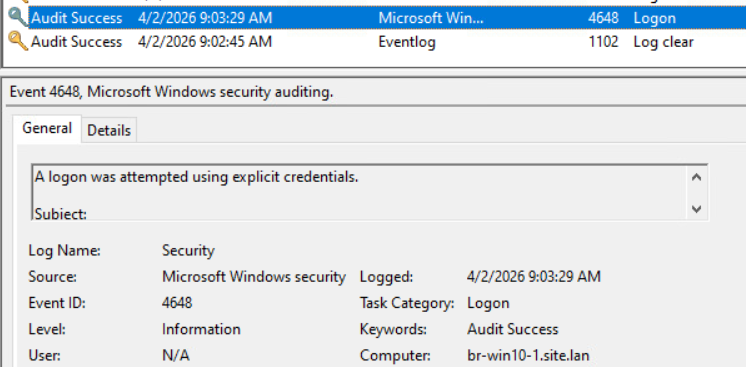
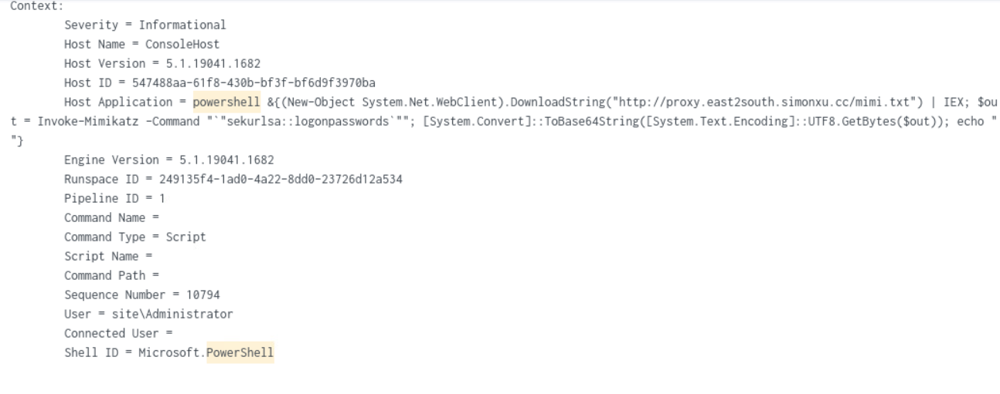
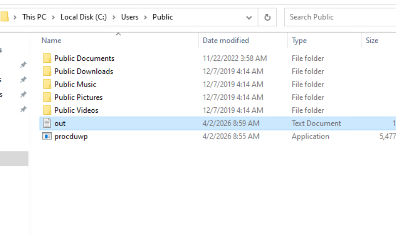
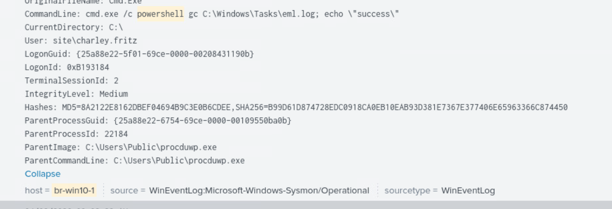
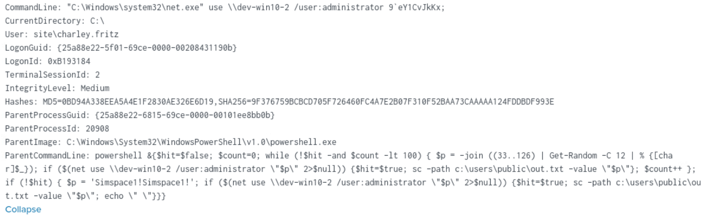
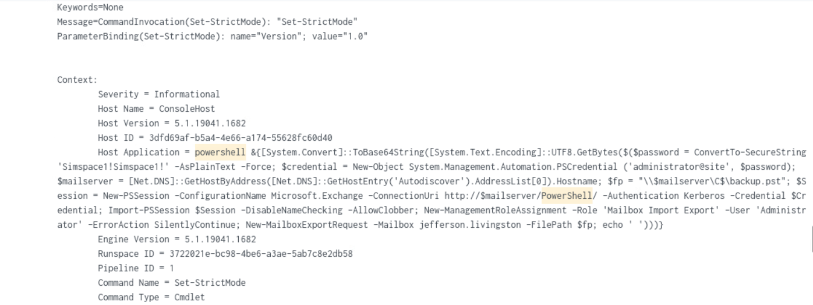
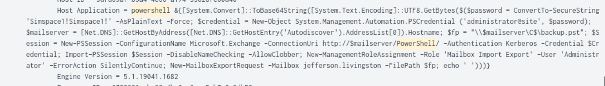

# Incident Response Case Study – Exchange Compromise Investigation

After three days of training to build and operate SimSpace, the platform we will use for future cyber training and for creating labs for CCDC, our team participated in a live incident response exercise on Thursday, April 2nd.

The event schedule included a `9:00 AM - 10:30 AM` LiveFire Exercise and a `1:00 PM - 2:30 PM` LiveFire Review Session. During the exercise, our team successfully identified every attack item in the scenario. The investigation went well, and our team finished as the winning team.

- Investigated multi-stage intrusion involving brute force, credential dumping (Mimikatz), lateral movement, and email exfiltration.
- Analyzed Windows Event Logs, PowerShell logs, and Security Onion data.
- Reconstructed attacker timeline and mapped techniques to MITRE ATT&CK.
- Identified indicators of compromise and root cause.


## Overview

This case study documents a multi-stage compromise affecting a Windows domain and Microsoft Exchange environment. The attacker obtained administrative access, executed PowerShell-based tooling, dumped credentials with Mimikatz, moved laterally through SMB, accessed Exchange, exported mailbox data, collected local files, staged data, and cleared logs to reduce visibility.

The investigation relied on Windows Event Logs, PowerShell logging, and endpoint/network telemetry to reconstruct activity and identify the scope of compromise.

## Log Hunting Reference

The following search was used to review relevant PowerShell activity during the investigation:

```spl
index="windows" host="br-win10-1" powershell earliest=-4h
```

## Executive Summary

An attacker gained initial access through the use of valid Administrator credentials, likely obtained through brute force or password reuse against exposed remote access. Once inside the environment, the attacker launched PowerShell commands, downloaded and executed Mimikatz, accessed additional systems over SMB, connected to Exchange, exported a mailbox to a PST file, gathered files from user-accessible locations, and cleared security logs.

This activity represents a full administrative compromise with confirmed collection of email and file data, along with clear signs of defense evasion.

## Attack Timeline

| Time | Activity |
|------|----------|
| External | Brute force attempts observed from `211.56.98.146` |
| 08:46 | Successful SSH login as `Administrator` from `10.10.254.1` |
| 08:55 | Malware/tool `C:\Users\Public\procduwp.exe` created |
| 08:55-08:59 | PowerShell scripts executed |
| 08:59 | Mailbox export initiated to PST |
| 09:02 | Windows Security logs cleared (`Event ID 1102`) |
| 09:03 | Explicit credential logon activity recorded (`Event ID 4648`) |

## Attack Chain

1. Initial Access via valid Administrator credentials.
2. PowerShell-based execution and tool staging.
3. Credential dumping with Mimikatz.
4. Discovery of accounts, files, and accessible systems.
5. Lateral movement using SMB and administrative credentials.
6. Exchange access and mailbox export.
7. File collection and local staging.
8. Log clearing and other defense evasion actions.

## Evidence and Analysis

### 1. Initial Access and Log Manipulation

Windows Security logs showed explicit credential usage and subsequent log clearing, supporting the conclusion that the attacker operated with administrative privileges on `br-win10-1`.

```text
Accepted password for administrator from 10.10.254.1 port 42526 ssh2
```

```text
Event ID 1102 - Security log cleared
```



### 2. PowerShell Execution and Credential Dumping

PowerShell logs captured the download and in-memory execution of Mimikatz from the malicious URL `http://proxy.east2south.simonxu.cc/mimi.txt`, followed by `sekurlsa::logonpasswords` to dump credentials from memory.

```text
Invoke-Mimikatz -Command "sekurlsa::logonpasswords"
```



### 3. Malware Staging and File Artifacts

The attacker staged tools and output files under `C:\Users\Public`, including `procduwp.exe` and an `out` file. These artifacts are consistent with attacker tooling dropped for credential theft, process execution, or data staging.

```text
C:\Users\Public\procduwp.exe
```

```text
C:\Users\Public\out
```



PowerShell and process telemetry also showed commands reading staged logs and executing through `procduwp.exe`, reinforcing the use of living-off-the-land execution chained with a dropped binary.



### 4. Lateral Movement over SMB

The attacker used SMB and `net use` commands to move to internal hosts with administrative credentials. The observed command line shows attempts to access `\\dev-win10-2` using the `administrator` account.

```text
net use \\dev-win10-2 /user:administrator
```



### 5. Exchange Access and Mail Export

The intruder used remote PowerShell against Exchange and issued a mailbox export request targeting `jefferson.livingston`, writing output to `\\mailserver\C$\backup.pst`.

```text
New-MailboxExportRequest -Mailbox jefferson.livingston -FilePath \\mailserver\C$\backup.pst
```



The Exchange-related command sequence confirms administrative Exchange access and use of mailbox export privileges.



## MITRE ATT&CK Mapping

| Technique | ID |
|-----------|----|
| Brute Force | `T1110` |
| Valid Accounts | `T1078` |
| PowerShell Execution | `T1059.001` |
| Credential Dumping (LSASS) | `T1003.001` |
| Account Discovery | `T1033` |
| SMB/Windows Admin Shares | `T1021.002` |
| File Discovery | `T1083` |
| Data from Local System | `T1005` |
| Archive or Collected Data | `T1560` |
| Exfiltration Over Alternative Protocol | `T1048` |
| Indicator Removal on Host / Clear Logs | `T1070` |

## Indicators of Compromise

| Type | Value |
|------|-------|
| External IP | `211.56.98.146` |
| Internal IP | `10.10.254.1` |
| Internal IP | `172.16.5.102` |
| Malware Path | `C:\Users\Public\procduwp.exe` |
| Output File | `C:\Users\Public\out` |
| Staging Folder | `C:\Windows\Tasks` |
| PST File | `C:\backup.pst` |
| Malicious URL | `http://proxy.east2south.simonxu.cc/mimi.txt` |
| Tool | `Mimikatz` |
| Account | `Administrator@site` |

## Root Cause

The compromise was enabled by multiple control failures:

- SSH service exposed to the internet.
- Weak or reused Administrator credentials.
- No multi-factor authentication for remote access.
- No account lockout policy to stop brute force attempts.
- Administrator account permitted remote interactive access.

## Impact

The attacker was able to:

- Obtain privileged credentials.
- Dump credentials from memory.
- Move laterally across internal systems.
- Access Microsoft Exchange administrative functions.
- Export at least one mailbox to PST.
- Collect sensitive user files.
- Clear logs to hinder detection and response.

Overall, the incident reflects domain-level administrative compromise with confirmed collection activity and likely data exfiltration.

## Recommendations

- Reset all privileged and administrator passwords immediately.
- Enforce MFA for VPN, SSH, and all remote administrative access.
- Disable direct use of built-in Administrator for remote logon.
- Restrict SSH exposure to VPN or approved management networks only.
- Implement account lockout and password hardening policies.
- Monitor `Event ID 4625`, `4688`, `7045`, and `1102`.
- Alert on PowerShell downloads, encoded commands, and credential dumping behavior.
- Block outbound access to malicious infrastructure including `211.56.98.146` and `proxy.east2south.simonxu.cc`.
- Review Exchange administrative role assignments and mailbox export permissions.
- Deploy or tune EDR coverage for PowerShell, LSASS access, and SMB abuse.

## Conclusion

This investigation reconstructed a coordinated attack chain spanning valid-account access, PowerShell execution, credential dumping, SMB lateral movement, Exchange mailbox export, file collection, and log clearing. The evidence supports a high-confidence conclusion of administrative compromise with confirmed collection of sensitive data and strong indicators of attempted exfiltration.
